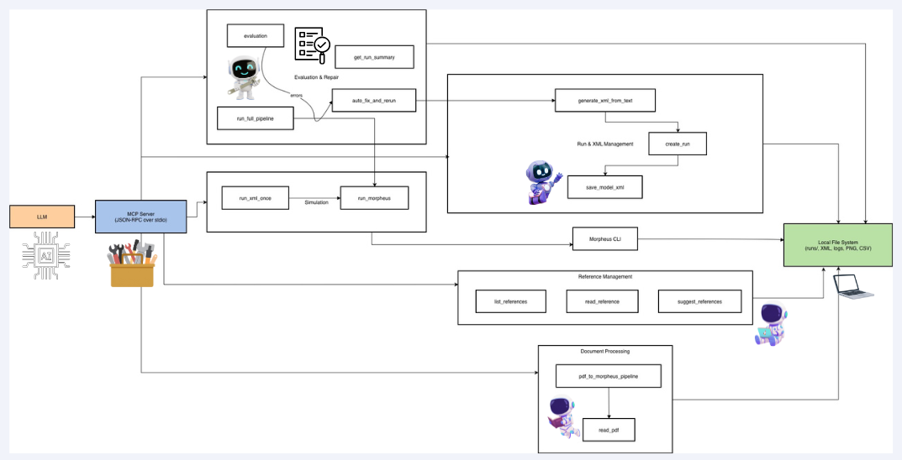
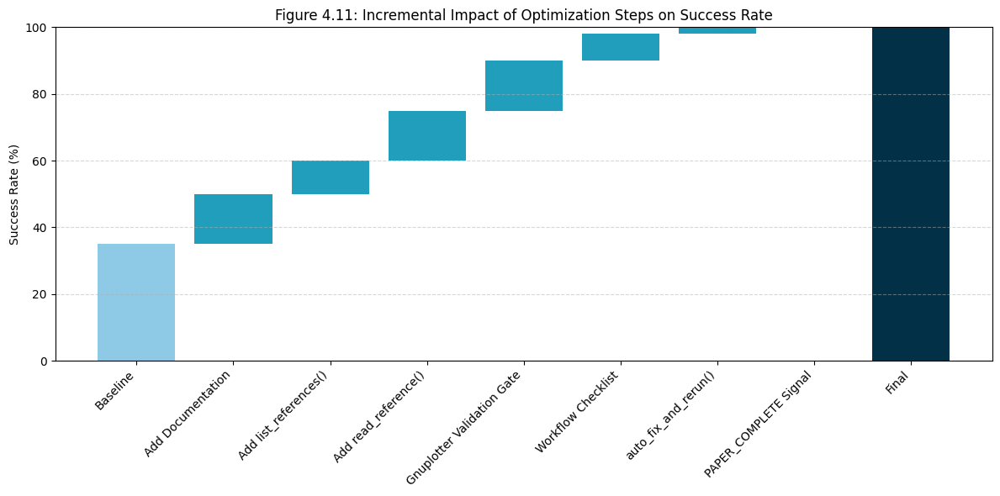
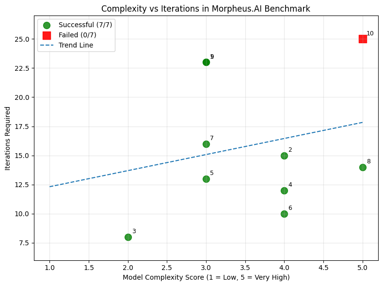
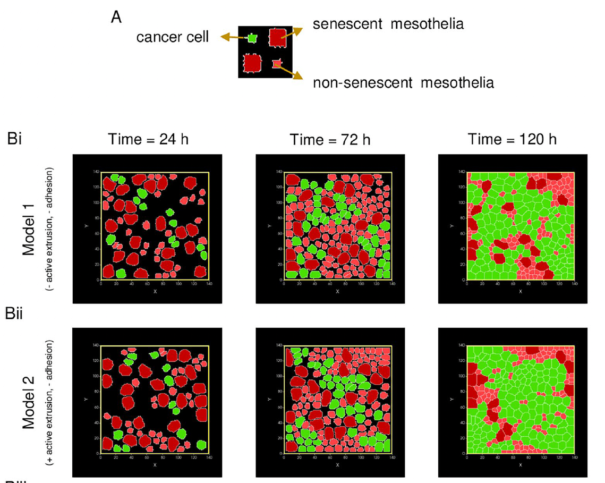
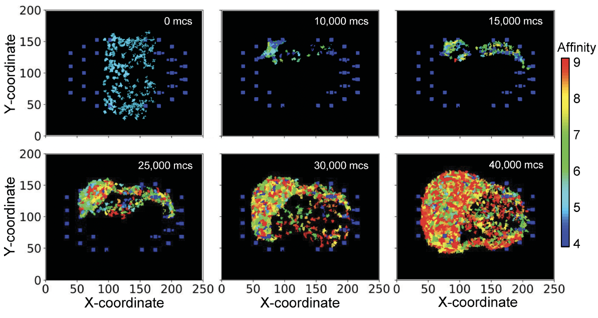

# Morpheus Benchmark Runner

[](https://www.python.org/downloads/)
[](https://opensource.org/licenses/MIT)
[](https://www.anthropic.com/)

An autonomous pipeline for converting scientific papers into executable Morpheus biological simulations using LLM-based agents with MCP (Model Context Protocol) tools.

---

## Overview

The Morpheus Benchmark Runner enables **fully autonomous** processing of scientific papers to generate MorpheusML simulation models. The system uses Claude AI with MCP tools to:

- Extract text from scientific PDFs
- Consult reference XML templates
- Generate MorpheusML models
- Execute Morpheus simulations
- Self-correct errors automatically
- Evaluate and score results

> **No manual intervention required.** Paper to simulation in ~7 minutes.

### What is Morpheus?

[Morpheus](https://morpheus.gitlab.io/) is a modeling and simulation environment for multicellular systems biology, used for computational models of cell migration, tissue development, and pattern formation. Models are defined using MorpheusML (XML-based).

### What is MCP?

The [Model Context Protocol](https://modelcontextprotocol.io/) (MCP) is a standardized interface for connecting AI models to external tools. In this project, MCP tools are Python functions that Claude calls to interact with the Morpheus environment.

---

## Architecture

```
┌─────────────────────────────────────────────────────────────────┐
│                    MORPHEUS BENCHMARK RUNNER                     │
├─────────────────────────────────────────────────────────────────┤
│                                                                  │
│  ┌──────────┐     ┌──────────────┐     ┌──────────────────┐    │
│  │   LLM    │────▶│  Tool Request │────▶│  MCP Functions   │    │
│  │   API    │◀────│  Tool Result  │◀────│   (server.py)    │    │
│  └──────────┘     └──────────────┘     └──────────────────┘    │
│        │                                        │                │
│        │                                        ▼                │
│        │                               ┌──────────────────┐     │
│        │                               │     Morpheus     │     │
│        │                               │    Simulator     │     │
│        │                               └──────────────────┘     │
│        ▼                                        │                │
│  ┌──────────┐                          ┌──────────────────┐     │
│  │ Benchmark│                          │  Output Files    │     │
│  │ Results  │                          │  (PNG, CSV, XML) │     │
│  └──────────┘                          └──────────────────┘     │
│                                                                  │
│       Loop repeats until "PAPER_COMPLETE" is signaled            │
└─────────────────────────────────────────────────────────────────┘

```
## Workflow

<p align="center">
  
</p>

<p align="center"><em>Complete MCP tool orchestration workflow for autonomous model generation</em></p>

---
---

## Features

| Feature | Description |
|---------|-------------|
| 🤖 **Autonomous Processing** | Papers processed without manual intervention |
| 📚 **Reference-Grounded Generation** | XML models based on official Morpheus examples |
| 🔧 **Automatic Error Recovery** | Failed simulations diagnosed and fixed (up to 2 attempts) |
| 📊 **Comprehensive Evaluation** | 7-point scoring system for quality assessment |
| ⏱️ **Rate Limit Handling** | Automatic exponential backoff for API limits |
| 💾 **JSON Output** | Structured results for further analysis |
| ✅ **Gnuplotter Validation** | Ensures visualization output is configured |

---

## Quick Start

### 1. Clone & Setup

```bash
git clone https://github.com/yourusername/Morpheus.AI.git
cd Morpheus.AI

python -m venv .venv
source .venv/bin/activate  # Windows: .venv\Scripts\activate
pip install -r requirements.txt
```

### 2. Configure API Key

```bash
export ANTHROPIC_API_KEY="sk-ant-api03-your-key-here"
```

### 3. Run Benchmark

```bash
python run_benchmark.py
```

> 📖 For detailed installation and configuration, see **[SETUP.md](SETUP.md)**

---

## Process Flow

1. **PDF Extraction** → `pdf_to_morpheus_pipeline()`
2. **Reference Discovery** → `list_references()`
3. **Template Loading** → `read_reference()`
4. **XML Generation** → `generate_xml_from_text()`
5. **Simulation Execution** → `run_morpheus()`
6. **Error Recovery** → `auto_fix_and_rerun()` (if needed)
7. **Evaluation** → `evaluation()`
8. **Completion** → "PAPER_COMPLETE" signal

---

## Evaluation Scoring

Each run is scored on a **0-7 point scale**:

| Criterion | Points | Description |
|-----------|--------|-------------|
| XML Errors | 0 to -N | Penalty for each error in stderr.log |
| Model Graph | +1 | `model_graph.dot` is generated |
| Time Progression | +1 to +3 | Simulation steps (1-10: +1, 11-50: +2, 51+: +3) |
| StopTime Match | +1 | Simulation completes to configured StopTime |
| Results Generated | +1 | At least one PNG or CSV produced |
| Bonus | +1 | 10+ PNG files generated |

**Score Interpretation:**
- **7/7** → Perfect run
- **5-6/7** → Good run, minor issues
- **3-4/7** → Partial success
- **0-2/7** → Failed or major problems

---

## Project Structure

```
morpheus-benchmark-runner/
├── server.py              # MCP tool implementations
├── run_benchmark.py       # Autonomous agent runner
├── requirements.txt       # Python dependencies
├── .env                   # API key (optional)
├── README.md              # This file
├── SETUP.md               # Detailed setup guide
│
├── references/            # Reference XML templates
│   ├── CPM/               # Cellular Potts Model examples
│   ├── PDE/               # Partial Differential Equations
│   ├── ODE/               # Ordinary Differential Equations
│   ├── Multiscale/        # Multiscale models
│   └── Miscellaneous/     # Other examples
│
└── papers/                # Input PDF papers
    ├── paper1.pdf
    └── ...
```

---

## Output Example

```
══════════════════════════════════════════════════════════════════
  MORPHEUS BENCHMARK RUNNER
══════════════════════════════════════════════════════════════════
  Model: claude-sonnet-4-5-20250929
  Papers: 10
  Max iterations per paper: 25
══════════════════════════════════════════════════════════════════

Processing paper 1/10: paper1.pdf
  ✓ PDF extracted
  ✓ References loaded
  ✓ XML generated
  ✓ Simulation completed
  ✓ Evaluation: 7/7

────────────────────────────────────────────────────────────────
  Paper Result: COMPLETED
  Score: 7/7 | PNGs: 249 | CSVs: 150 | Iterations: 23
────────────────────────────────────────────────────────────────
```

---

## Cost Estimation

| Model | Est. Cost (10 papers) | Processing Time |
|-------|----------------------|-----------------|
| claude-sonnet-4-20250514 | $5-10 | ~60-90 min |
| claude-sonnet-4-5/6-20250929 | $8-15 | ~70-100 min |
| claude-opus-4-5/6-20250514 | $15-30 | ~90-120 min |

---

## Documentation

- **[SETUP.md](SETUP.md)** — Detailed installation, configuration, and troubleshooting
- **[API Reference](SETUP.md#api-reference)** — MCP tool documentation

---

## Benchmark Results

The system was evaluated on **10 scientific papers** spanning diverse areas of multicellular biology.

### Performance Summary

| Metric | Value |
|--------|-------|
| **Success Rate** | 90% (9/10 papers) |
| **Average Score** | 6.3 / 7 |
| **Perfect Scores (7/7)** | 9 papers |
| **Total PNGs Generated** | 944 |
| **Total CSVs Generated** | 162 |
| **Total Processing Time** | 70 min 39 sec |
| **Avg. Time per Paper** | ~7 minutes |

### Individual Paper Results

| # | Paper | Domain | Score | PNGs | CSVs | Iterations | Status |
|---|-------|--------|-------|------|------|------------|--------|
| 1 | Szabó et al. (2010) | Cell Sorting | 7/7 | 249 | 150 | 23 | ✅ |
| 2 | Thapa et al. (2024) | Tissue Development | 7/7 | 112 | 1 | 15 | ✅ |
| 3 | Carpenter et al. (2024) | Cell Migration | 7/7 | 62 | 1 | 8 | ✅ |
| 4 | Atwell et al. (2025) | Germ Cell Proliferation | 7/7 | 111 | 1 | 12 | ✅ |
| 5 | Berkemeier et al. (2023) | Cellular Mechanics | 7/7 | 52 | 1 | 13 | ✅ |
| 6 | Herron et al. (2022) | Multicellularity | 7/7 | 43 | 2 | 10 | ✅ |
| 7 | Scheel et al. (2021) | Cell Invasion | 7/7 | 111 | 2 | 16 | ✅ |
| 8 | Mu et al. (2024) | Morphogenesis | 7/7 | 103 | 1 | 14 | ✅ |
| 9 | Luque et al. (2023) | Pattern Formation | 7/7 | 101 | 3 | 23 | ✅ |
| 10 | Berkhout et al. (2025) | Population Dynamics | 0/7 | 0 | 0 | 25 | ❌ |

### Score Distribution



### Iterations per Paper




### Biological Relevance

Generated simulations were compared against original paper figures to assess biological accuracy:

<table>
<tr>
<th>Original Output</th>
<th>Generated Output</th>
</tr>
<tr>
<td></td>
<td></td>
</tr>
<tr>
<td colspan="2" align="center"><em>The senescent mesothelial matrix accentuates colonization by ovarian cancer cells (Thapa et al., 2024) : Differential adhesion driven segregation</em></td>
</tr>
<tr>
<td></td>
<td></td>
</tr>
<tr>
<td colspan="2" align="center"><em>multiscale spatial modeling framework for the germinal center response (Mu et al., 2024) : Concentration gradients of chemoattractants</em></td>
</tr>    
</table>

### Model Comparison

| Model | Success Rate | Avg. Iterations | Processing Time | Est. Cost |
|-------|-------------|-----------------|-----------------|-----------|
| Sonnet 4 | 70% | 18.2 | 95 min | ~$6.50 |
| **Sonnet 4.5** | **90%** | **15.9** | **71 min** | **~$11.50** |
| Opus 4.5 | 90% | 14.7 | 68 min | ~$28.00 |

> **Recommendation:** Sonnet 4.5 offers the best cost-performance balance.

---

---

## Demo Videos

Detailed workflow demonstrations are available:

<table>
  <tr>
    <th>Demo</th>
    <th>Description</th>
    <th>Link</th>
  </tr>
  <tr>
    <td>🎬 <strong>Single Paper Processing</strong></td>
    <td>Claude Desktop with Morpheus MCP tools</td>
    <td><a href="https://youtu.be/zAx-x72KlNI" target="_blank">Watch on YouTube</a></td>
  </tr>
  <tr>
    <td>🎬 <strong>10-Paper Benchmark</strong></td>
    <td>Autonomous API execution with MCP tools</td>
    <td><a href="https://youtu.be/Wa7bmkVPw7k" target="_blank">Watch on YouTube</a></td>
  </tr>
</table>

---


## Acknowledgments

- **[Morpheus](https://morpheus.gitlab.io/)** — TU Dresden, ZIH
- **[Anthropic](https://www.anthropic.com/)** — Claude AI and API
- **[MCP](https://modelcontextprotocol.io/)** — Model Context Protocol

---

## License

MIT License — see [LICENSE](LICENSE) for details.
